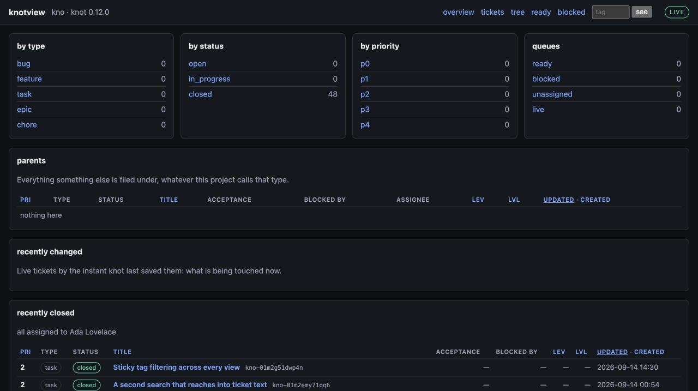
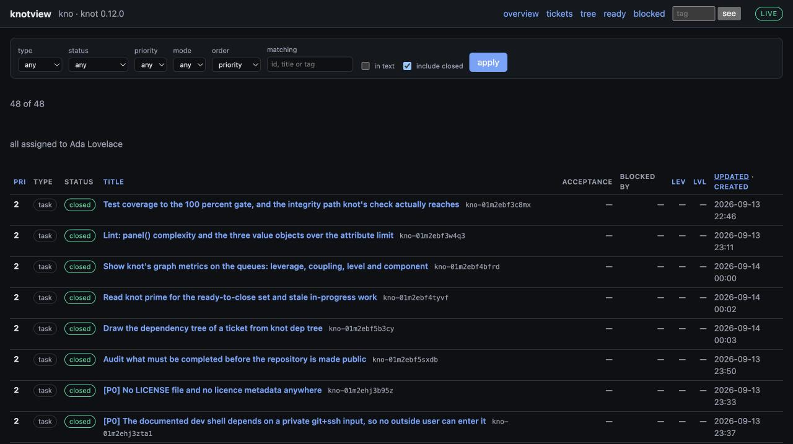
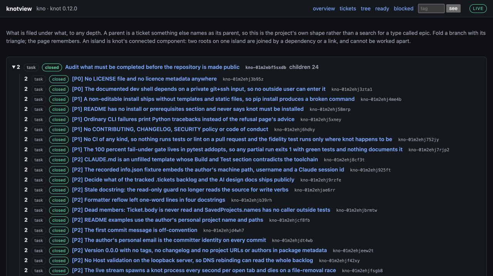
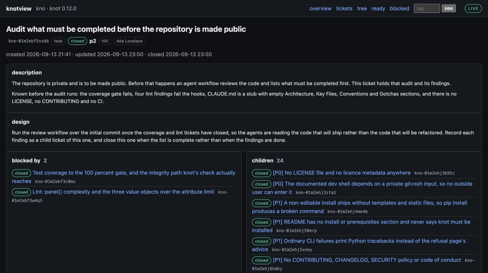
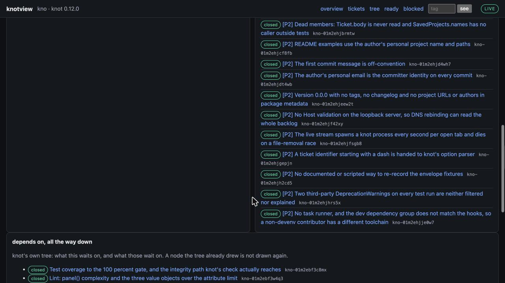

# knotview

A read-only web panel over a [knot](https://github.com/UniSoma/knot) backlog, shaped by the
project's own configuration rather than by this panel's idea of one.

**Built on knot.** [knot](https://github.com/UniSoma/knot), by
[UniSoma](https://github.com/UniSoma), is the ticket tracker this panel reads: markdown tickets
with YAML frontmatter that live in the repository beside the code, a dependency graph with ready
and blocked queues, acceptance criteria that gate closing, and a JSON protocol on every command
built for handing work to an agent. Everything this panel shows is knot's data and knot's
vocabulary. If you have not met knot, start there: its README explains the design, and
`knot serve` ships a panel of its own that this one grew out of wanting more of.

- [A look at it](#a-look-at-it)
- [Quick start](#quick-start)
- [Saved projects](#saved-projects)
- [What it shows](#what-it-shows)
- [Developing](#developing)
- [Design](#design)
- [Licence](#licence)

## A look at it

The panel over its own backlog, every ticket of which is closed, so the tickets page shows the
closed set and the tree was drawn over it. Open a section to see a view.

<details open>
<summary><strong>Overview</strong> — the backlog counted by type, status, priority and queue, with what changed and what closed</summary>


</details>

<details>
<summary><strong>Tickets</strong> — every ticket, filtered, ordered and searched, with the closed ones on request</summary>


</details>

<details>
<summary><strong>Tree</strong> — what is filed under what, each branch foldable, and what is filed under nothing</summary>


</details>

<details>
<summary><strong>Ticket</strong> — one ticket's sections as markdown, what blocks it, its children, and knot's dependency tree</summary>




</details>

The queues are empty here because nothing is live; point the panel at a backlog with open
work and they fill in.

## Quick start

### Requirements

| You need | Because |
|---|---|
| Python 3.12 or later | the package targets it |
| `knot` on your `PATH`, or `--knot /path/to/knot` | knotview never reads ticket files; it runs `knot ... --json` and shows the answer |
| A knot project: a directory holding `.knot.edn` or `.tickets/` | that is what knot reads |

### Install and run

```bash
uv tool install git+https://github.com/krimsonkla/knotview
knotview --repository /path/to/a/knot/project --port 7778
```

Then open <http://127.0.0.1:7778/>.

From a checkout instead: `uv sync --all-groups`, then
`uv run knotview --repository /path/to/a/knot/project`. A plain `pip install .` also works and
installs the `knotview` command.

The panel binds loopback only and has no authentication, because it shows a whole backlog to
whoever can reach it. Do not put it on a network.

## Saved projects

Two projects open at once is the ordinary case, and each needs its own port, so a project's path
and port can be saved under a name and served by that name afterwards:

```bash
knotview --repository ~/git/one --port 7778 --save one
knotview --repository ~/git/two --port 7779 --save two
knotview one
knotview two
```

A flag still wins for one run: `knotview one --port 8000` serves the saved path on another port
without changing what is saved. The names live in `~/.config/knotview/projects.toml`, or under
`XDG_CONFIG_HOME` where that is set, as plain TOML you can edit. They are saved per machine rather
than in the project, because which port is free and where a checkout lives are facts about the
machine.

## What it shows

Every page is a GET and every filter is a query parameter, so any view is a link you can keep.

The bar on every page holds the tags you have chosen to see the backlog through. Add one there
and every view narrows to tickets carrying all of them, on every page, until you clear it. The
choice lives in a cookie in your browser; the panel still writes nothing.

| Page | What is on it |
|---|---|
| **Overview** `/` | The backlog counted by type, status and priority, each read from the project's own declared values, so a type nobody has filed yet still appears. knot's ready and blocked queues, the unassigned, and what its integrity check reports. Parents with a progress bar each. What changed recently and what closed recently. What `knot prime` says wants attention: tickets ready to close, and tickets gone stale. |
| **Tickets** `/tickets` | Every ticket, filtered by type, status, priority, mode, assignee, tag or component, ordered by priority, leverage, level, update, creation, title or id, with the closed ones on request. Search matches id, title and tags; tick *in text* and it reaches the body, showing the sentence that matched. Applied filters are chips you can remove one at a time. |
| **Tree** `/tree` | What is filed under what, nested to any depth, each branch foldable and the fold remembered in your browser. Island chips name knot's connected components. Tickets filed under nothing, and under a parent that is not live, are listed on their own, because that is where work goes missing. |
| **Queues** `/queue/ready`, `/queue/blocked` | knot's own queues. The blocked queue is grouped by level into the rounds of closing before each ticket can start. |
| **Ticket** `/ticket/<id>` | The sections as the ticket wrote them, rendered as markdown; the acceptance criteria with what is met; the parent as a breadcrumb and the siblings under it; both directions of the graph; the links; knot's dependency tree drawn all the way down, a missing dependency shown as such; and the notes as a timeline, newest first. |
| **Live** | A one-way stream says when the backlog changed and the page reloads itself. Rows saved since you last looked are marked, and the bar counts them. |

## Developing

The panel is developed inside a [devenv](https://devenv.sh) shell, which supplies Python, uv,
knot, the formatters and the commit hooks. `devenv up` serves the panel over this repository's
own backlog, which is the fixture the panel is developed against:

```bash
devenv shell          # everything on PATH, uv sync already run
devenv up             # serves http://127.0.0.1:7778/ over this repository
KNOTVIEW_REPOSITORY=/path/to/another/project KNOTVIEW_PORT=7779 devenv up
```

That shell pulls its hooks and knot from a private layer repository, so today it evaluates only
for the maintainer. Nothing in the package or the tests depends on it: `uv sync --all-groups`
gives you the same tools, and [CONTRIBUTING.md](CONTRIBUTING.md) lists every check, the coverage
gate, and how the recorded test fixtures are kept honest against a real knot.

## Design

**It reads.** Nothing here writes a ticket. Every route is a GET, the only commands it runs are
knot's read verbs, and only one module can start a process; tests assert all three. The backlog
stays driven by whatever drives it.

**It reads through knot.** Through `knot ... --json`, never by parsing `.tickets/` directly. knot
owns that schema; a second parser here would be a second schema, and it would drift on the first
release that adds a field.

**It follows without being asked.** The live stream carries a digest of the ticket files rather
than markup, so what you see after a change is exactly what a fresh visit shows: one rendering
path.

**Why not `knot serve`?** knot ships its own panel, and it is good at what it does: three fixed
groups, in progress over ready over blocked, expanded inline. What it does not do is navigate a
project's own types, filter, show the closed work, draw the shape of what is filed under what,
or follow changes without being asked. That is what this adds.

## Licence

MIT. See [LICENSE](LICENSE).
